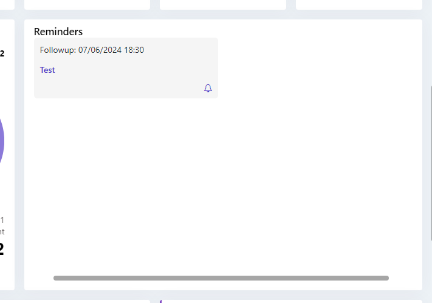
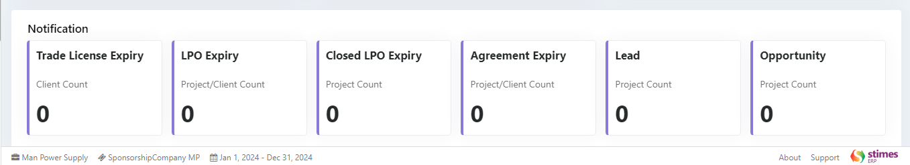

# CRM Dashboard

## Overview

The CRM Dashboard in our ERP software is designed to provide an organized view of key data related to employees, customers, and ongoing tasks. When you first open the CRM Dashboard, it will be blank by default. To start using it, you need to select an employee from the dropdown in the top-right corner. Here’s what happens after selecting an employee:

    

## Employee Information

When you select an employee, their complete information automatically appears on the dashboard. This includes:

    

    <ul>
        <li><strong>Employee Image</strong></li>
        <li><strong>Name</strong></li>
        <li><strong>Phone</strong></li>
        <li><strong>Email</strong></li>
        <li><strong>Designation</strong></li>
    </ul>

You will also see the Total Outstanding Amount associated with the employee, giving a quick glance at any pending payments.

    

## CRM Data Overview

In addition to employee details, you’ll have access to various business metrics:

    <ul>
        <li><strong>New Customers: </strong>A count of newly added customers.</li>
        <li><strong>Total Tasks: </strong>The total number of tasks assigned to the employee.</li>
        <li><strong>Leads: </strong>The number of new leads the employee is handling.</li>
        <li><strong>Opportunities: </strong>Sales opportunities the employee is working on.</li>
    </ul>

    

## Task Management

You can view all tasks assigned to the selected employee, along with their current status (e.g., In Pending, Completed). This helps you track the progress of tasks easily.

    

## Monthly Comparison

A key feature of the dashboard is the monthly comparison analog graph. It displays key financial metrics, making it easy to compare the employee’s performance with the previous month. The X-axis represents the months and the Y-axis represents the amount. The graph shows:

    

    <ul>
        <li><strong>Sales Target: </strong>The target amount set for the employee.</li>
        <li><strong>Invoiced Amount: </strong>The total amount invoiced by the employee.</li>
        <li><strong>Collected Amount: </strong>The total payments collected.</li>
    </ul>

This comparison allows you to track whether the employee is improving or underperforming in terms of sales and collection, offering a clear snapshot of their progress.

## Client, Project, and Sales Data

In another section of the dashboard, you can view details like:

    <ul>
        <li><strong>Active Clients: </strong>A count of clients currently active.</li>
        <li><strong>Active Projects: </strong>The number of ongoing projects.</li>
        <li><strong>Total Sales: </strong>The total sales figures generated by the employee.</li>
    </ul>

    

##  Reminders

You can set reminders for the selected employee, which will appear in the reminders section to help keep track of important upcoming tasks or deadlines.

    

## Timesheet Status

You can also check the status of the current month’s timesheet for the employee, displayed as an image with:

    <ul>
        <li><strong>Collected Timesheets</strong></li>
        <li><strong>Missing Timesheets</strong></li>
    </ul>

    

## Mobilization Details

The dashboard provides important mobilization statistics:

    <ul>
        <li><strong>Number of Mobilized and Demobilized Employees This Month</strong></li>
        <li><strong>Total Mobilized and Demobilized Count</strong></li>
        <li><strong>Total Active Employees</strong></li>
        <li><strong>NOCs Created (No Objection Certificates)</strong></li>
    </ul>

    

## Notifications

Lastly, you will see notifications related to different project or client events, with counts for each category:

    <ul>
        <li><strong>Trade License Expiry: </strong>The number of clients whose trade license is expiring soon.</li>
        <li><strong>LPO Expiry: </strong>The number of projects or clients whose Local Purchase Orders (LPOs) are about to expire.</li>
        <li><strong>Closed LPO Expiry: </strong>The count of expired LPOs associated with closed projects.</li>
        <li><strong>Agreement Expiry: </strong>The count of client or project agreements nearing expiration</li>
        <li><strong>Lead: </strong>The number of leads linked to projects</li>
        <li><strong>Opportunities: </strong>The number of opportunities tied to specific projects</li>
    </ul>

    

