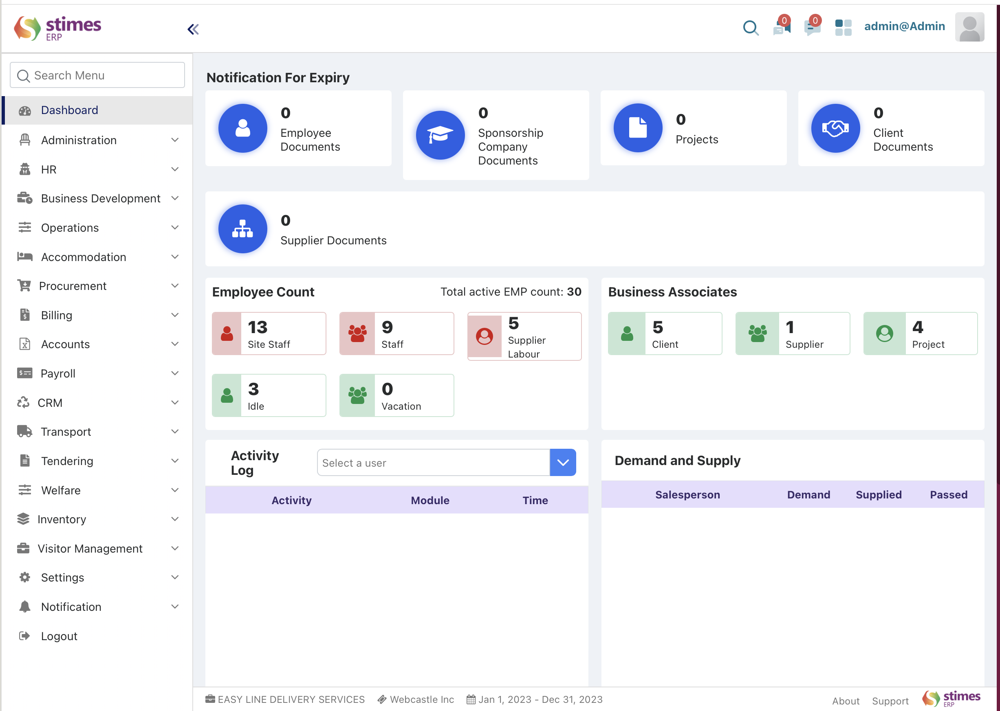

 # DASHBOARD 

>Stimes Dashboard is designed to guide users through key workforce metrics and modules, offering a clear view and easy navigation. It can be customized as per customer requirements for enhanced usability.

>When you log in, you'll access a dynamic dashboard and module navigator , allowing you to explore the dashboard's functionalities and access essential information. 
>Easily navigate modules with customizable widgets for real-time analytics, aiding decision-making. Access a user-friendly dashboard for comprehensive  workforce oversight in the ERP system

