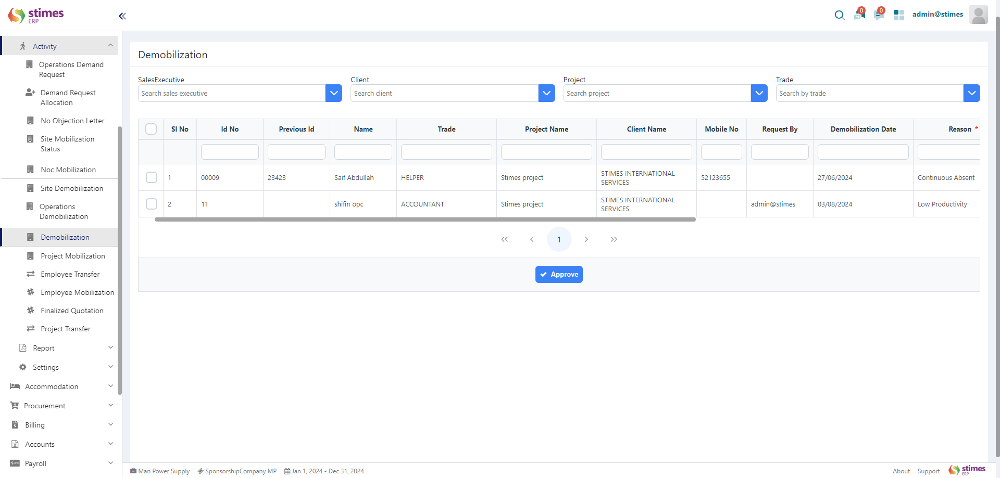

# Operation Demobilization

## Overview
The Demobilization module is the final step in the employee demobilization process within your ERP system. Once the Operation Demobilization request has been approved, the final demobilization can be completed in this module. This step ensures that all accommodation and transportation details are finalized, and the employee is officially demobilized from the project site.

### Steps to Complete Demobilization

    <ul>
        <li><strong>Access the Demobilization Module:</strong> Navigate to the Demobilization section in the ERP system.</li>
        <li><strong>View Approved Requests:</strong> All approved demobilization requests from the operation team will be listed here. Each request will include details such as the employee name, demobilization date, reason, and the site from which they are being demobilized.</li>
    </ul>

    

    <ul>
        <li><strong>Select Accommodation Status:</strong> Choose the appropriate accommodation status for the employee.</li>
        <li><strong>Options may include</strong></li>
            <ol>Own: The employee arranges their own Accommodation.</ol>
            <ol>Client: Accommodation is arranged by the client.</ol>
            <ol>Supplier: Accommodation is provided by the supplier.</ol>
    </ul>

    

    <ul>
        <li><strong>Select Transportation Status:</strong> Choose the appropriate transportation status for the employee.</li>
        <li><strong>Options may include</strong></li>
            <ol>Own: The employee arranges their own transportation.</ol>
            <ol>Client: Transportation is arranged by the client.</ol>
            <ol>Supplier: Transportation is provided by the supplier.</ol>
    </ul>

    

    <ul>
        <li><strong>Approve the Request:</strong> Once the accommodation and transportation statuses are selected, approve the request. Click the Approve button to finalize the demobilization. After approval, the employee is officially demobilized from the site. Their status will be updated in the system, and they will be removed from the list of active employees on the project site.</li>
        <li><strong>Options may include</strong></li>
            <ol>Own: The employee arranges their own transportation.</ol>
            <ol>Client: Transportation is arranged by the client.</ol>
            <ol>Supplier: Transportation is provided by the supplier.</ol>
    </ul>

    

