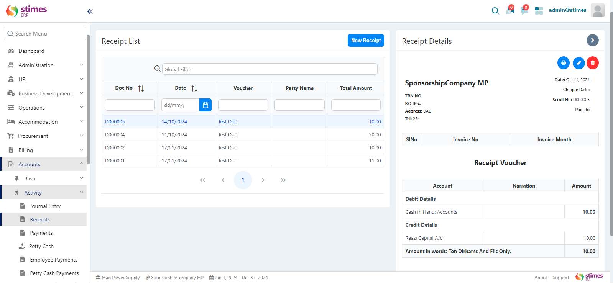

# Receipt

## What is a Receipt?

A Receipt is a document that confirms a payment made. In the ERP system, you can create receipts for cash, bank transactions, or post-dated checks (PDC).

    

## How to Create a New Receipt

Follow these simple steps to create a new Receipt in your ERP system:

### Step 1: Click the New Receipt Button

    <ul>
        <li>To create a new receipt, go to the Receipt section under the Accounts Module.</li>
        <li>Click the New Receipt button.</li>
    </ul>

    

### Step 2: Choose Receipt Type

You will see options to select the type of receipt you want to create. Choose from the following:

    

    <ul>
        <li><strong>Cash</strong></li>
        <li><strong>Bank</strong></li>
        <li><strong>PDC (Post-Dated Check)</strong></li>
    </ul>

Also, you will see a checkbox for A/c Payee. Check this box if applicable.

#### If You Select Cash

A new form will open with the following fields:

    

    <ul>
        <li><strong>Doc No:</strong> This number is autogenerated by the system.</li>
        <li><strong>Date:</strong> Select the date for the receipt.</li>
        <li><strong>Cash Document:</strong> Select the cash document from the dropdown. The associated account will be selected automatically and will be disabled.</li>
        <li><strong>Ledger Type:</strong> Choose either General Ledger or Client from the dropdown.</li>
        <li><strong>Payee:</strong> Enter the name of the person or entity receiving the payment.</li>
        <li><strong>Document Upload:</strong> You can upload any supporting documents.</li>
        <li><strong>Narration:</strong> Enter a brief description of the transaction.</li>
        <li><strong>Account:</strong> Select the appropriate account from the dropdown.</li>
        <li><strong>Cost Center:</strong> Specify the cost center related to this transaction.</li>
        <li><strong>Analysis Code:</strong> Enter the analysis code if applicable.</li>
        <li><strong>Receipt:</strong> Enter the receipt amount.</li>
        <li><strong>Grand Total:</strong> This will be calculated automatically.</li>
    </ul>

Once all fields are filled out, click Save to create the receipt.

#### If You Select Bank

A new form will open with similar fields:

    

    <ul>
        <li><strong>Doc No:</strong> This number is autogenerated by the system.</li>
        <li><strong>Date:</strong> Select the date for the receipt.</li>
        <li><strong>Bank Document:</strong> Select the bank document from the dropdown. The associated account will be selected automatically and will be disabled.</li>
        <li><strong>Cheque No:</strong> Enter the cheque number.</li>
        <li><strong>Cheque Date:</strong> Select the date on the cheque.</li>
        <li><strong>Ledger Type:</strong> Choose either General Ledger or Client from the dropdown.</li>
        <li><strong>Payee:</strong> Enter the name of the payee.</li>
        <li><strong>Document Upload:</strong> You can upload any supporting documents.</li>
        <li><strong>Narration:</strong> Enter a brief description of the transaction.</li>
        <li><strong>Account:</strong> Select the appropriate account from the dropdown.</li>
        <li><strong>Cost Center:</strong> Specify the cost center related to this transaction.</li>
        <li><strong>Analysis Code:</strong> Enter the analysis code if applicable.</li>
        <li><strong>Receipt:</strong> Enter the receipt amount.</li>
        <li><strong>Grand Total:</strong> This will be calculated automatically.</li>
    </ul>

After filling out all the fields, click Save.

#### If You Select PDC (Post-Dated Check)

A new form will open with the following fields:

    

    <ul>
        <li><strong>Doc No:</strong> This number is autogenerated by the system.</li>
        <li><strong>Date:</strong> Select the date for the receipt.</li>
        <li><strong>Bank Document:</strong> Select the bank document from the dropdown. The associated account will be selected automatically and will be disabled.</li>
        <li><strong>Cheque No:</strong> Enter the cheque number.</li>
        <li><strong>Cheque Date:</strong> Select the date on the cheque.</li>
        <li><strong>Ledger Type:</strong> Choose either General Ledger or Client from the dropdown.</li>
        <li><strong>Payee:</strong> Enter the name of the payee.</li>
        <li><strong>Document Upload:</strong> You can upload any supporting documents.</li>
        <li><strong>Narration:</strong> Enter a brief description of the transaction.</li>
        <li><strong>Account:</strong> Select the appropriate account from the dropdown.</li>
        <li><strong>Cost Center:</strong> Specify the cost center related to this transaction.</li>
        <li><strong>Analysis Code:</strong> Enter the analysis code if applicable.</li>
        <li><strong>Receipt:</strong> Enter the receipt amount.</li>
        <li><strong>Grand Total:</strong> This will be calculated automatically.</li>
    </ul>

Click Save to create the receipt.

### Final Step: Status Selection

After filling in all the required information in the form (whether for Cash, Bank, or PDC), the next step is to set the status of the receipt.

    

    <ul>
        <li><strong>Status Options:</strong></li>
        <ol>Open: The receipt is still in progress and can be edited.</ol>
        <ol>Rejected: The receipt has been rejected, and no further action can be taken.</ol>
        <ol>Approved: The receipt is finalized and approved. Once approved, the receipt cannot be edited.</ol>
    </ul>

Once the status is set, click Save to complete the receipt creation process.

### Post-Creation Actions:

    <ul>
        <li>Download the Receipt as PDF: You can save a copy for your records.</li>
        <li>Edit the Receipt: If the receipt status is Open, you can edit it. However, if it is Approved, you won’t be able to make changes.</li>
    </ul>

    

## Important Things to Know:

    <ul>
        <li>Always ensure that the details are accurate before saving.</li>
        <li>The Doc No is autogenerated, so you don’t need to worry about it.</li>
        <li>Ensure you have all necessary documents uploaded to support the receipt.</li>
        <li>You can track the status of the receipt and take necessary actions as needed.</li>
    </ul>

