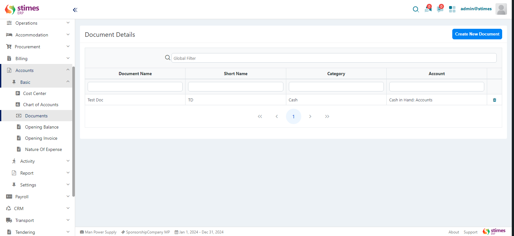

# Documents

## What are Documents in the Accounts Module?

In the Accounts Module, Documents are used to organize different financial transactions. Documents link to specific accounts and categories such as Cash, Bank, or Journal. By creating documents, you make sure that your payments, receipts, and other financial activities are properly categorized and tracked.

    

## Example Scenario:

Let's say you need to create a document for cash payments. You would:

    <ul>
        <li>Click Create New Document.</li>
        <li>Enter Document Name as "Cash Payment."</li>
        <li>Select Category as Cash.</li>
        <li>Set the Payment Prefix as "CASH-P" and the Receipt Prefix as "CASH-R."</li>
        <li>Select the PDC radio button if this document will be used for post-dated cheques.</li>
    </ul>

## How to Create a New Document

Follow these easy steps to create a new document:

### Step 1: Click the "Create New Document" Button

In the Documents section of the Accounts Module, look for the Create New Document button in the top-right corner of the screen. Click on it to start creating a new document.

    

### Step 2: Fill in the Document Information

A form will appear where you need to fill in details about the document. Here’s how to do it:

    

    <ul>
        <li><strong>Document Name</strong>Enter the full name of the document. For example, "Payment Voucher" or "Receipt Voucher."</li>
        <li><strong>Short Name:</strong> Type a short version of the document name, like "PV" for "Payment Voucher."</li>
        <li><strong>Account: </strong>Select the account related to the document from the dropdown menu. This account will be used when this document is selected in transactions.</li>
        <li><strong>Category:</strong> Choose the document category from the dropdown. The options are:</li>
            <ol>Cash: For handling cash transactions.</ol>
            <ol>Bank: For managing bank transactions.</ol>
            <ol>Journal: For recording journal entries.</ol>
        <li><strong>PDC (Post-Dated Cheque):</strong> Select the radio button if this document will be used for post-dated cheque transactions.</li>
    </ul>

### Step 3: Fill in Additional Fields Based on the Category

Depending on the category you selected, additional fields will appear:

#### If Category is Cash:

    

    <ul>
        <li><strong>Payment Prefix:</strong> Enter a prefix that will appear before payment document numbers (e.g., "CASH-P").</li>
        <li><strong>Receipt Prefix:</strong> Enter a prefix that will appear before receipt document numbers (e.g., "CASH-R").</li>
    </ul>

#### If Category is Bank:

    

    <ul>
        <li><strong>Payment Prefix:</strong> Enter a prefix for payment document numbers (e.g., "BANK-P").</li>
        <li><strong>Receipt Prefix:</strong> Enter a prefix for receipt document numbers (e.g., "BANK-R").</li>
    </ul>

#### If Category is Journal:

    

    <ul>
        <li><strong>Journal Prefix:</strong> Enter a prefix for journal document numbers (e.g., "JOURNAL").</li>
    </ul>

### Step 4: Save or Cancel

Once you have filled in all the details:

    <ul>
        <li>Save: Click this button to save the new document.</li>
        <li>Cancel: Click this button if you don’t want to save the document and want to go back.</li>
    </ul>

## Where are These Documents Used?

The documents you create are used in different areas, such as:

    <ul>
        <li><strong>Payments</strong></li>
        <li><strong>Receipts</strong></li>
        <li><strong>Petty Cash</strong></li>
    </ul>

These documents help ensure that the right account is selected for each transaction. For example, when processing a payment, you can select the appropriate document, and the system will automatically link it to the correct account.

## Important Things to Know:

    <ul>
        <li><strong>Document Name and Short Name:</strong> Help you identify the document in transactions.</li>
        <li><strong>Account and Category:</strong> Make sure the right account is used for different types of transactions.</li>
        <li><strong>Prefixes:</strong> Prefixes help organize and identify document numbers for cash, bank, or journal transactions.</li>
        <li><strong>PDC Option:</strong> Select this if the document is used for post-dated cheque transactions.</li>
    </ul>

