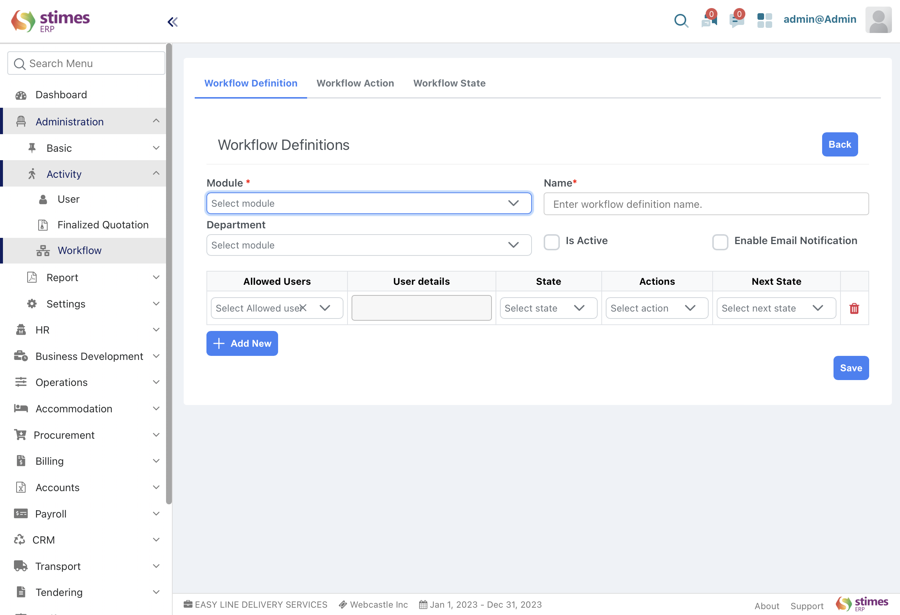

# Workflow
- In Stimes ERP, you can configure multiple levels of approval for various processes allows you to set up structure of a procedure /functionality ensuring thorough validation before finalizing critical documents like Clearance, Demand request, by setting workflow you can make several functionality systematically 
>- For example, procurement process where multiple levels of approval are necessary for purchase orders. Initially, a procurement officer (user with 'Procurement Officer' role) creates a purchase order. This purchase order then undergoes approval or rejection by a procurement manager (user with 'Procurement Manager' role). If approved by the procurement manager, it is further reviewed and approved or rejected by the finance director (user with 'Finance Director' role)

## To set up a Workflow and define transition rules in Stimes ERP, follow these Key prerequisite steps:

> 	Workflow action- Go to workflow action list and create actions either approve or reject, verify the workflow change directly, streamlining the approval process.it will reflect in workflow definition, If a User is eligible to take action on some workflows only after approval or rejection action 

> 	Workflow state- Workflow State represents a specific stage within a workflow that you define. These states can be reached based on different Workflow Actions applied to them. For instance, if you're setting up a workflow with multiple approval levels from managers, senior managers, general managers, etc., you can configure the states accordingly using Workflow States 
- 	Go to workflow state list and create system status with name(project manager rejected) and state colour
eg;-(Approved – Green, Rejected-Red) 

 
>	Workflow definition- Go to workflow definition list and create workflow definition with module(benefit request, procurement request), name , department, allowed user, state and what action of created state and what is the next state, and option for email notification 

