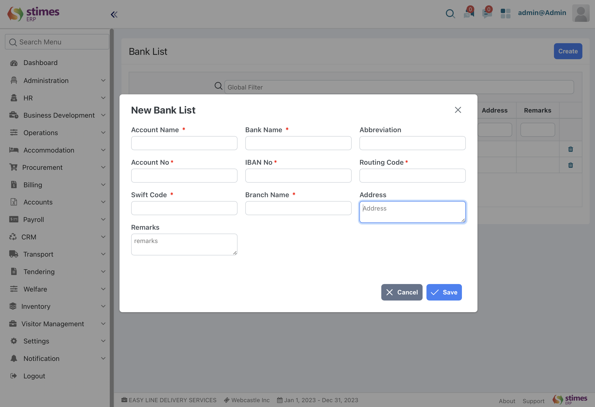

# Bank A/c Setup
> Manage bank accounts by adding necessary bank details, account numbers, and types.
- Go to the bank list ,  click on create new bank list with account name, bank name, abbreviation ,account number, 
IBAN no, branch name, address, remarks 

      Administration> basic> bank 

