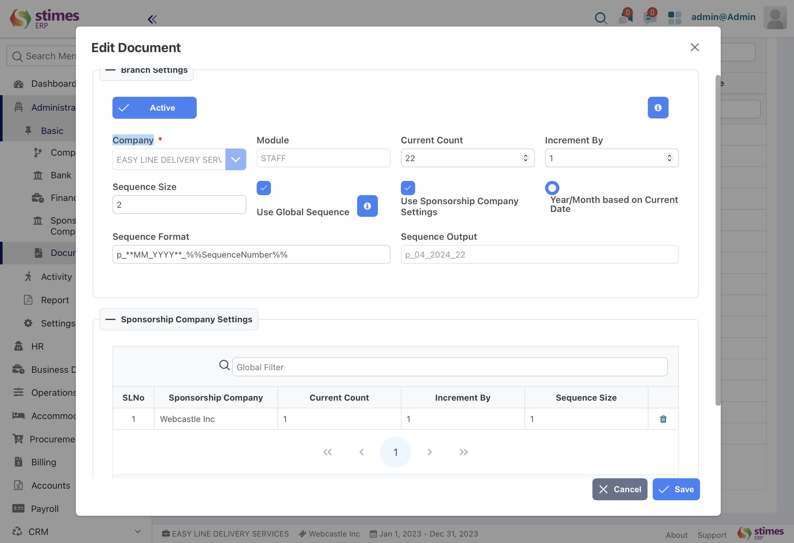

# Document Sequence
- In Stimes ERP, you can create document prefixes that generate unique series for your documents. This system allows for multiple series across all transaction types, providing flexibility in managing and organizing your documents efficientl
For instance, a series with the prefix STIMESINV12#### could generate IDs like STIMESINV120001, STIMESINV120002, 

administration> basic> document sequence 

> To configure naming series in Stimes ERP for different transactions
>
>- Select the transaction type for which you want to create the series.
>- Edit the series by adding unique prefixes for each series, with each prefix on a new line. The first prefix will be the default prefix.
>- you can set Sequence Format like :- Date : To add date add **dateformat** (ie, **yy** is given then 24 will be output)  
>Sequence Number : To print sequence number add%%SequenceNumber%%
>Note: Anything text added in sequence format will be will be included in sequence number
if sequence format should be P_01_2023_001_S (ie,"Prefix_Month_Year_SequenceNumber_Suffix" ,then it sequence format should be P_**MM_yyyy**_%%SequenceNumber%%_S)
>- You can either set sequence in Global sequence or by sponsorship company 

