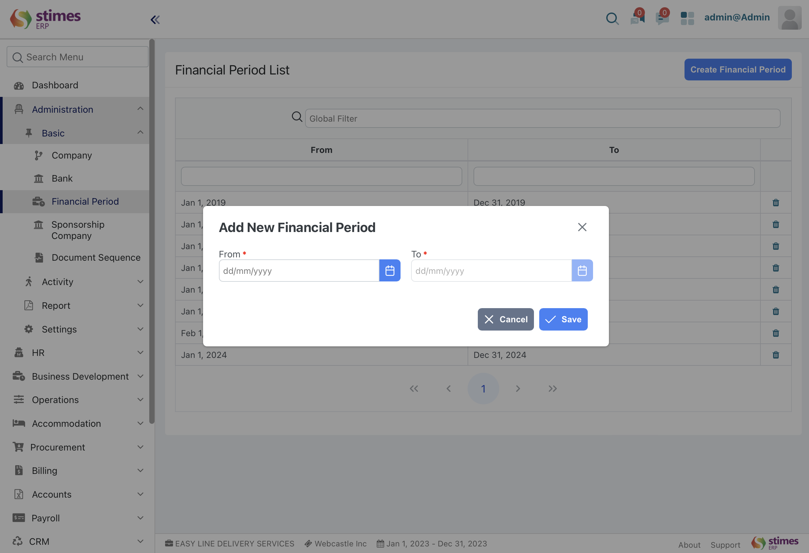

# Financial period
> Manage accounting periods, opens and closes periods for transaction in a financial year
- Go to financial period list, click on create financial period 
Set period 
   
      Administration> basic> financial period 

