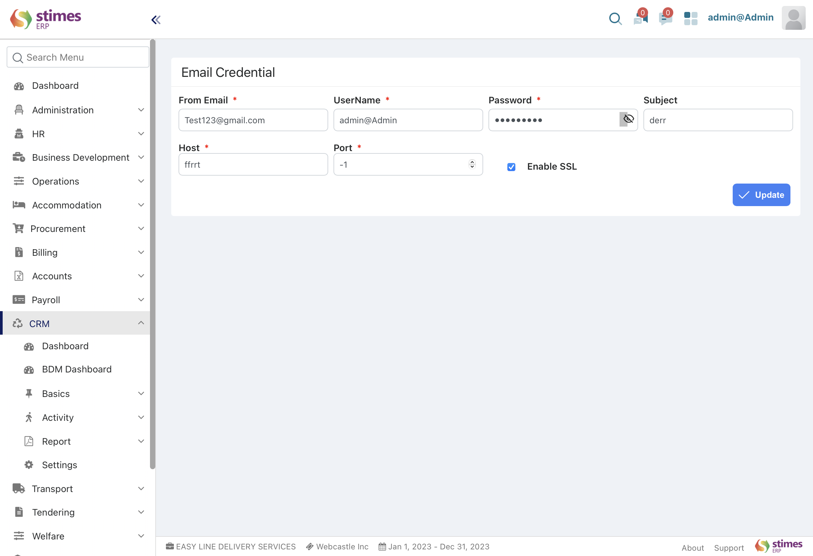
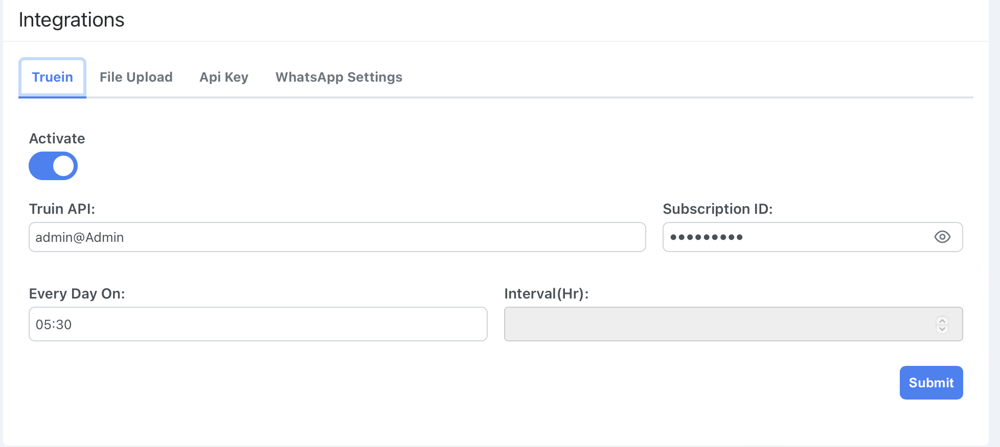

# Settings
>- Managing sender  email credentials  for sending/receiving emails for workflow definition /CRM quotation 

>- Integrating the ERP system with external applications/services using APIs for data exchange and automation.

