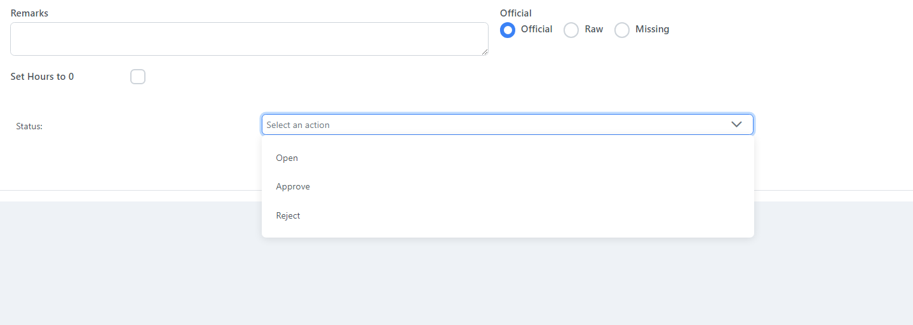

# Timesheet

## Overview
This documentation covers the process of managing timesheets within our system. There are two types of timesheets:

### Types of Timesheets

    <ul>
        <li><strong>Client Timesheet</strong></li>
        <li><strong>Manual Client Timesheet</strong></li>
    </ul>

### Creating a Timesheet
>	You can access and manage your timesheets through the following sections: **Billing** **→** **Activity** **→** **Client Timesheet** or **Manual Client Timesheet**

## Client Timesheet

Client timesheets are automatically generated based on the activities and tasks logged for a specific client. These timesheets are linked with client projects and billing.

    

### Creating a Client Timesheet

The following fields are required to create a client timesheet:

    <ul>
        <li><strong>TimeSheet No:</strong>This field will be auto-generated.</li>
        <li><strong>Client:</strong>Search and select the client for whom the timesheet is being created.</li>
        <li><strong>Site:</strong>Specify the site associated with the client. You can create multiple sites under a single client. When generating a client timesheet, you must select at least one site or you can select multiple sites for the timesheet generation.</li>
    </ul>

    

    <ul>
        <li><strong>Designation:</strong>Select the designation of the employee you want to generate client timesheet. You can create multiple designations. Designations will only appear in the client timesheet after employee mobilizing data has been added in project mobilizing data. This can be navigated using **Operation > Activity > Project Mobilization**, where site details and mobilized employees with their designations can be viewed.The designation will only show in the client timesheet after selecting the site.</li>
    </ul>

    
    

    <ul>
        <li><strong>Month:</strong>Select the month for which the timesheet is applicable.</li>
        <li><strong>From Date:</strong>Set the starting date for the timesheet period.</li>
        <li><strong>To Date:</strong>Set the ending date for the timesheet period.</li>
    </ul>

    

    <ul>
        <li><strong>Official:</strong>Mark the timesheet as Official, Raw, or Missing.</li>
    </ul>

    <table>
        <tr>
            <td style="width: 20%;">Official</td>
            <td style="text-align: left;">A timesheet marked as official means an invoice can be created against it.</td>
        </tr>
        <tr>
            <td style="width: 20%;">Raw</td>
            <td style="text-align: left;">A timesheet marked as raw will only create a draft. At month-end, generate the client timesheet as raw to provide the employee's salary. After obtaining the employee mobilize data, edit the client timesheet and convert it from raw to official.</td>
        </tr>
        <tr>
            <td style="width: 20%;">Missing</td>
            <td style="text-align: left;">If exact employee data is not available, mark the timesheet as missing.</td>
        </tr>
    </table>

    <ul>
        <li><strong>Set Hours to 0:</strong>If data is unavailable, enable the checkbox to generate the timesheet with zero hours.</li>
        <li><strong>Status:</strong>Initially set to open. It can be edited to be approved or rejected.</li>
    </ul>

    

### Generating and Viewing Timesheets

After clicking "Generate," the timesheet will be created under the selected designation. If "Set Hours to 0" is checked, all dates will display the employee's hours as zero. The timesheet can be edited after it has been generated. Here’s an example of the Timesheet generation interface:

    

### Exporting Timesheets

    

    <h3>Export Options</h3>
    <ul>
        <li><strong>Show Client Id:</strong> Display the client ID in the export.</li>
        <li><strong>Show Previous Id:</strong> Display the previous ID in the export.</li>
        <li><strong>Show Rate And Amount:</strong> Include rate and amount details.</li>
        <li><strong>Show VAT:</strong> Include VAT information.</li>
        <li><strong>Include Logo:</strong> Add a logo to the export.</li>
        <li><strong>Show Approved By:</strong> Display the approver's details.</li>
        <li><strong>Show OT Details:</strong> Include overtime details.</li>
        <li><strong>Show Tradewise:</strong> Display trade-wise information.</li>
        <li><strong>Hour Format:</strong> Export in hour format.</li>
        <li><strong>Attendance Format:</strong> Export in attendance format.</li>
    </ul>

### Related Topics

* [How to Create a Client ?](../client.md)
* [How to Create a Site ?](../site.md)
* [How to Create a Designation ?](../designation.md)