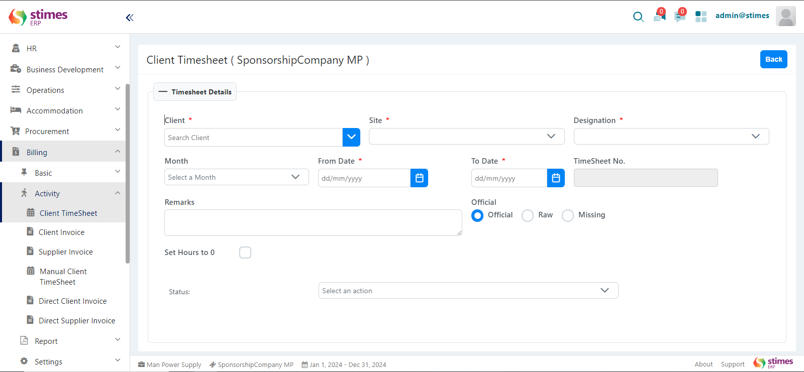
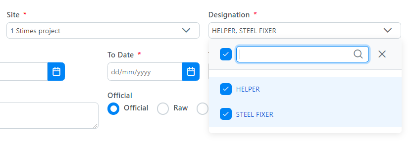

# Timesheet
## Navigating Timesheets

> You can access and manage your timesheets through the following sections:
> - **Billing**
>   - **Activity**
>     - **Client Timesheet** / **Manual Client Timesheet**

## Types of Timesheets

### 1. Client Timesheet
### 2. Manual Client Timesheet

## Client Timesheet

Client timesheets are automatically generated based on the activities and tasks logged for a specific client. These timesheets are linked with client projects and billing.

    

### Creating a Client Timesheet

The following fields are required to create a client timesheet:

##### 1. TimeSheet No:
This field will be auto-generated.

##### 2. Client:
Search and select the client for whom the timesheet is being created.

##### 3. Site:
Specify the site associated with the client. You can create multiple sites under a single client. When generating a client timesheet, you must select at least one site or you can select multiple sites for the timesheet generation.

    

##### 4. Designation:
Select the designation of the employee you want to generate client timesheet. You can create multiple designations. Designations will only appear in the client timesheet after employee mobilizing data has been added in project mobilizing data. This can be navigated using **Operation > Activity > Project Mobilization**, where site details and mobilized employees with their designations can be viewed.The designation will only show in the client timesheet after selecting the site.

    
    

##### 5. Month:
Select the month for which the timesheet is applicable.

##### 6. From Date:
Set the starting date for the timesheet period.

##### 7. To Date:
Set the ending date for the timesheet period.

##### 8. Official:
Mark the timesheet as Official, Raw, or Missing.

    <table>
        <tr>
            <td>**Official**</td>
            <td>A timesheet marked as official means an invoice can be created against it.</td>
        </tr>
        <tr>
            <td>**Raw**</td>
            <td>A timesheet marked as raw will only create a draft. At month-end, generate the client timesheet as raw to provide the employee's salary. After obtaining the employee mobilize data, edit the client timesheet and convert it from raw to official.</td>
        </tr>
        <tr>
            <td>**Missing**</td>
            <td>If exact employee data is not available, mark the timesheet as missing.</td>
        </tr>
    </table>

##### 9. Set Hours to 0:
If data is unavailable, enable the checkbox to generate the timesheet with zero hours.

##### 10. Status:
Initially set to open. It can be edited to be approved or rejected.

### Related Topics

* [How to Create a Client ?](../client.md)
* [How to Create a Site ?](../site.md)
* [How to Create a Designation ?](../designation.md)