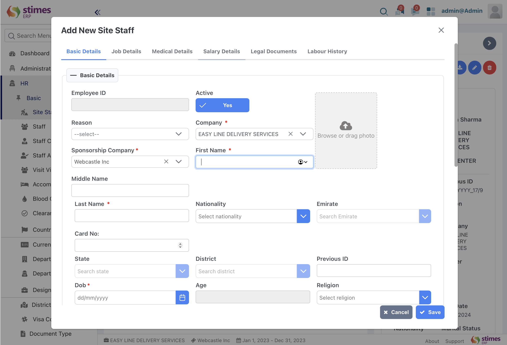

> # Site Staff
>An Individual directly involved in on-site tasks like construction or maintenance. They oversee operations, coordinate with teams, ensure safety, and complete site-specific tasks.
>
>- In stimeserp You can create  a new site staff with relevant details like basic details, job details, medical details, salary details, legal documents, labour history 

To create Site Staff:HR> Basic> Site Staff 
