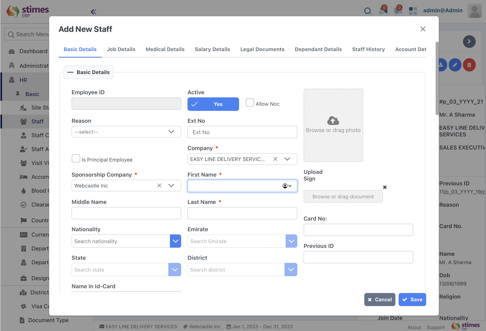

# Staff 
>The Staff module in stimesERP system typically includes a range of functionalities related to managing employees within an organization

>- ### Staff
>This Sub-module encompass to create a new staff with relevant details like basic details, job details, medical details, salary details, legal documents, dependant details, staff history and account detail
To create staff:HR> Basic> Staff 

## How to Create a Staff
1. Fill the required basic details 
