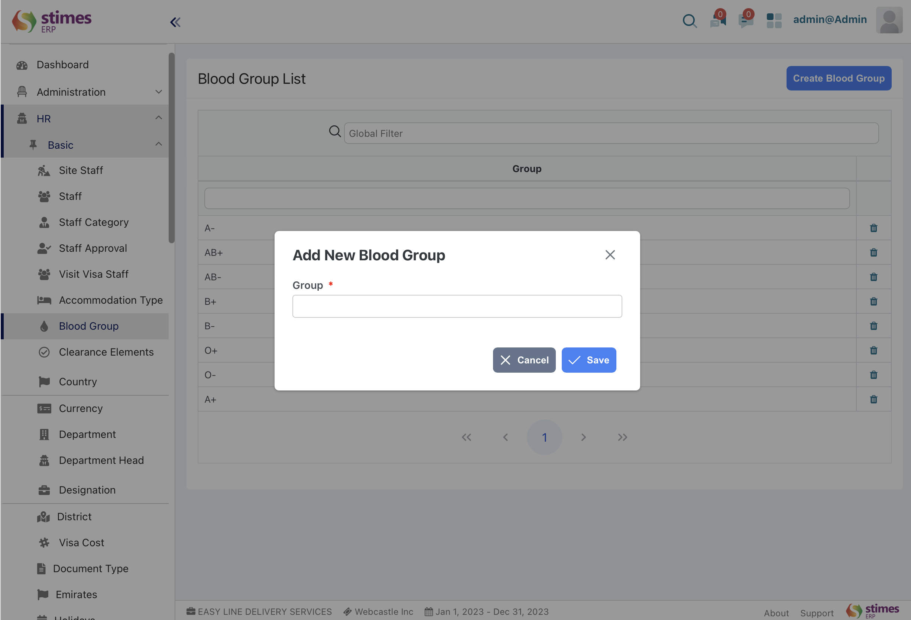

# Blood group
>- In stimeserp, the blood group list typically refers to a database or record of Staff's blood types. This information is important for medical purposes, such as emergency medical care or health insurance management within the organization.

>- The blood group list Sub-module  includes blood group list and we can create new blood group 

HR> Bloodgroup> create 

